# X-Ray Classification with PyTorch

Deep neural network model to classify the presence of pneumonia in a patient using their chest X-ray.

### Data Description

The dataset originates from Kermany et al. on Mendeley.  
The particular subset used for this project is sourced via Kaggle: [Chest X-ray Pneumonia Dataset](https://www.kaggle.com/paultimothymooney/chest-xray-pneumonia).

#### Acknowledgements
- Data: [Mendeley Data](https://data.mendeley.com/datasets/rscbjbr9sj/2)
- Citation: [Kermany et al.](http://www.cell.com/cell/fulltext/S0092-8674(18)30154-5)

The source data consisted of 300 training and 100 testing chest X-ray images.  
An additional validation split is created using 100 randomly selected images from the training set.  
Each dataset is evenly divided into two classes—NORMAL and PNEUMONIA—comprising X-ray images of healthy lungs and those affected by pneumonia.

#### Data Structure:
- `data/train`: 200 images (100 NORMAL, 100 PNEUMONIA)
- `data/val`: 100 images (50 NORMAL, 50 PNEUMONIA)
- `data/test`: 100 images (50 NORMAL, 50 PNEUMONIA)
```
data/
├── train/
│   ├── NORMAL/
│   └── PNEUMONIA/
├── val/
│   ├── NORMAL/
│   └── PNEUMONIA/
└── test/
    ├── NORMAL/
    └── PNEUMONIA/
```

All images are preprocessed and resized to 224x224 pixels using `transforms.Resize(224)` and `transforms.CenterCrop(224)`.  
Data is loaded into a `train_loader`, `val_loader`, and `test_loader` using the `DataLoader` class from the PyTorch library.

---

### Methods

- **Data Augmentation & Normalization:**  
  X-rays from the training data are applied with transformations and normalization (`train_transform`), while validation and testing datasets are applied with only normalization, not augmentation (`val_test_transform`).
  - Normalization is consistent with the ResNet-50 input domain using the mean and standard deviation of the three color channels (R, G, B) from the original ResNet-50 training dataset.
  - Random horizontal flipping is used to augment data and improve model robustness.

- **Pre-Trained Model:**  
  Fine-tuned the ResNet-50 model (`ResNet50_Weights.IMAGENET1K_V2`), a convolutional neural network pre-trained on ImageNet before optimizing it on our data.
  - Using pre-defined weights allows for accurate classification, faster training time, and fewer resource costs.

- **Transfer Learning & Fine-Tuning:**  
  Only the final layer of the network is retrained, reducing the computational cost and the amount of required training data.
  - Freezes the model’s convolutional layers and replaces the final fully connected layer with a single output neuron for binary classification (normal vs. pneumonia).

- **Efficient Training Loop With Early Stopping:**  
  Includes a validation set to monitor model performance and trigger early stopping after a set number of epochs without any improvements to the model, preventing overfitting while saving on computational resources.
  - Reduces the learning rate when validation loss plateaus using `ReduceLROnPlateau`.
  - Saves the best model checkpoint.

- **Performance Metrics:**  

- **Model Architecture:**  

### **Model Architecture:**

This project uses **ResNet-50**, a deep convolutional neural network built on the residual learning framework introduced by [He et al. (2015)](https://arxiv.org/pdf/1512.03385). Instead of learning a direct mapping $H(x)$, each residual block learns a residual function $F(x) = H(x) - x$, which is added back to the input via shortcut connections. This design mitigates vanishing gradients and allows effective training of very deep networks.

ResNet-50 consists of **50 weighted layers**:

* **1** initial convolutional layer
* **4 stages** of bottleneck residual blocks with \[3, 4, 6, 3] blocks per stage
* **1** final fully connected layer

Each bottleneck block contains **three convolutional layers** in a **1×1 → 3×3 → 1×1** pattern: the first 1×1 reduces dimensionality, the 3×3 processes spatial features, and the last 1×1 restores dimensionality with a 4× channel expansion. Downsampling is done via stride 2 in Conv1 and in the first block of stages 2–4.

Block distribution:

* Stage 1: Conv2\_x – 3 blocks, output depth 256
* Stage 2: Conv3\_x – 4 blocks, output depth 512
* Stage 3: Conv4\_x – 6 blocks, output depth 1024
* Stage 4: Conv5\_x – 3 blocks, output depth 2048

```mermaid
graph TD
    A[Input Image 224x224] --> B[Conv1: 7x7, 64, stride 2]
    B --> C[MaxPool: 3x3, stride 2]

    %% Stage 2
    C --> D1[Conv2_1: 1x1, 64 → 3x3, 64 → 1x1, 256]
    D1 --> D2[Conv2_2: 1x1, 64 → 3x3, 64 → 1x1, 256]
    D2 --> D3[Conv2_3: 1x1, 64 → 3x3, 64 → 1x1, 256]
    %% Skip connections Stage 2
    C -.->|projection| D1
    D1 -.-> D2
    D2 -.-> D3

    %% Stage 3
    D3 --> E1[Conv3_1: 1x1, 128, stride 2 → 3x3, 128 → 1x1, 512]
    E1 --> E2[Conv3_2: 1x1, 128 → 3x3, 128 → 1x1, 512]
    E2 --> E3[Conv3_3: 1x1, 128 → 3x3, 128 → 1x1, 512]
    E3 --> E4[Conv3_4: 1x1, 128 → 3x3, 128 → 1x1, 512]
    %% Skip connections Stage 3
    D3 -.->|projection| E1
    E1 -.-> E2
    E2 -.-> E3
    E3 -.-> E4

    %% Stage 4
    E4 --> F1[Conv4_1: 1x1, 256, stride 2 → 3x3, 256 → 1x1, 1024]
    F1 --> F2[Conv4_2: 1x1, 256 → 3x3, 256 → 1x1, 1024]
    F2 --> F3[Conv4_3: 1x1, 256 → 3x3, 256 → 1x1, 1024]
    F3 --> F4[Conv4_4: 1x1, 256 → 3x3, 256 → 1x1, 1024]
    F4 --> F5[Conv4_5: 1x1, 256 → 3x3, 256 → 1x1, 1024]
    F5 --> F6[Conv4_6: 1x1, 256 → 3x3, 256 → 1x1, 1024]
    %% Skip connections Stage 4
    E4 -.->|projection| F1
    F1 -.-> F2
    F2 -.-> F3
    F3 -.-> F4
    F4 -.-> F5
    F5 -.-> F6

    %% Stage 5
    F6 --> G1[Conv5_1: 1x1, 512, stride 2 → 3x3, 512 → 1x1, 2048]
    G1 --> G2[Conv5_2: 1x1, 512 → 3x3, 512 → 1x1, 2048]
    G2 --> G3[Conv5_3: 1x1, 512 → 3x3, 512 → 1x1, 2048]
    %% Skip connections Stage 5
    F6 -.->|projection| G1
    G1 -.-> G2
    G2 -.-> G3

    %% Output
    G3 --> H[Average Pooling]
    H --> I[Fully Connected Layer - 1000 classes]
```



Note: Solid arrows are the main path; dashed arrows are skip connections, with projection indicating a 1×1 convolution to match dimensions.

---

### Results

- **Test Accuracy:** ~0.810 (81.0%)
- **Test F1-Score:** ~0.838 (83.8%)

These scores indicate the model performs well in distinguishing pneumonia-affected lungs from normal lungs.
